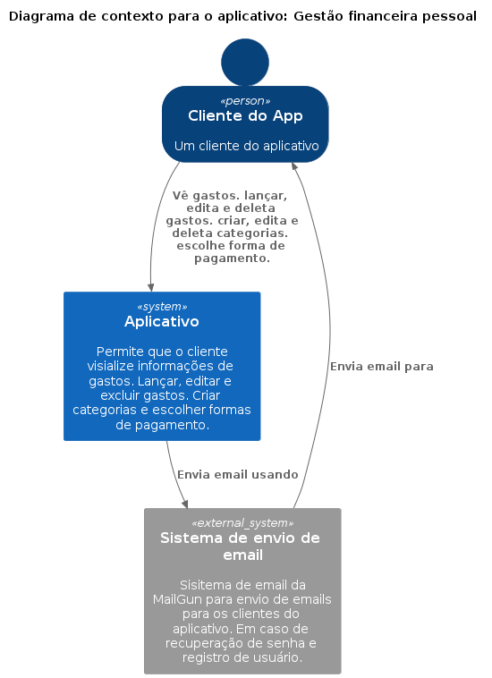
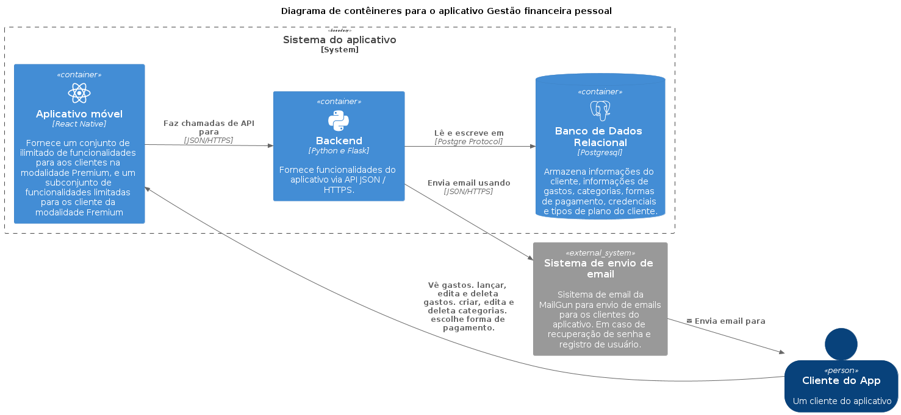

<div align="center">
  <h1>Backend: Se controla - Aplicativo de gestão financeira</h1>
</div>

----

## Arquitetura do projeto

### Diagrama de Contexto




### Diagrama de Container




## Features do `MVP`

<details><summary>Login</summary>
<p>

- Email
- Senha

</p>
</details>


<details><summary>Register</summary>
<p>

- Nome
- Email
- Senha

</p>
</details>


<details><summary>Home</summary>
<p>

- Gráfico pizza por categorias resumo do mês
- Histórico dos último gastos (card)

</p>
</details>


<details><summary>Gastos</summary>

- <details><summary>CRUD gastos</summary>
  <p>

  - Nome*
  - Valor*
  - Categoria*
  - Forma de pagamento*
  - Status*
  - Data
  - Comprovante (Premium)

  </p>
  </details>

- <details><summary>CRUD** categorias</summary>
  <p>

  - Nome
    - Freemium pode cadastra apenas uma categoria
    - Premium sem limites de cadastro

  </p>
  </details>

- <details><summary>CRUD** Forma de pagamento</summary>
  <p>

  - Nome

  </p>
  </details>

- Gasto detalhado
- ** Chumbado de início

</details>

<details><summary>Perfil</summary>
<p>

- CRUD usuário

</p>
</details>

## Ambiente de desenvolvimento local

### 1° Passo

> Clone o repositório

```
git clone git@github.com:organize-dot-me/backend.git
```

### 2° Passo

> Entre no diretório do projeto

```
cd backend
```

### 3° Passo

> Crie o ambiente virtual

```
python3 -m venv .venv
```

### 4° Passo

> Ative o ambiente virtual

```
source .venv/bin/activate
```

### 5° Passo

> Instale as dependências

```
pip install -r requirements.txt
```

### 6° Passo

> Instale o pre-commit

```
pre-commit install
```

### 7° Passo

> Rodar o projeto fora do container. `Atensão: o ambiente virtual deve estar ativado.`

```
gunicorn -w 5 -b 0.0.0.0:5000 "server:create_app()"
```

### 8° Passo

> Rodar o projeto em um container `Docker`

```
docker-compose up
```

